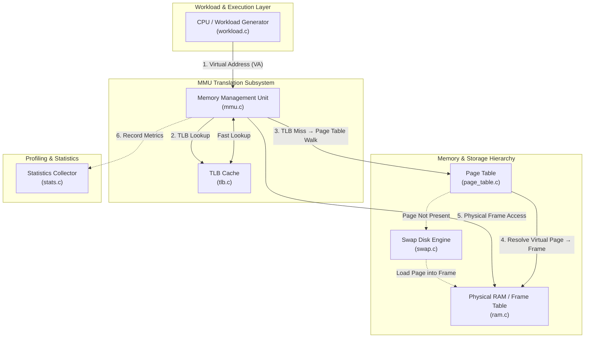
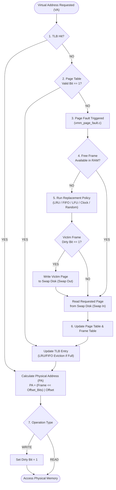

```mermaid
flowchart TB

    %% ============================================================
    %% CPU / WORKLOAD
    %% ============================================================
    subgraph Workload["Workload & Execution Layer"]
        CPU["CPU / Workload Generator<br/>(workload.c)"]
    end

    %% ============================================================
    %% ADDRESS TRANSLATION
    %% ============================================================
    subgraph Translation["MMU Translation Subsystem"]

        MMU["Memory Management Unit<br/>(mmu.c)"]
        TLB["TLB Cache<br/>(tlb.c)"]

        MMU <-->|"Fast Lookup"| TLB
    end

    %% ============================================================
    %% MEMORY
    %% ============================================================
    subgraph Memory["Memory & Storage Hierarchy"]

        PT["Page Table<br/>(page_table.c)"]
        RAM["Physical RAM / Frame Table<br/>(ram.c)"]
        SWAP["Swap Disk Engine<br/>(swap.c)"]
    end

    %% ============================================================
    %% STATISTICS
    %% ============================================================
    subgraph Analytics["Profiling & Statistics"]
        STATS["Statistics Collector<br/>(stats.c)"]
    end

    %% ============================================================
    %% MAIN PATH
    %% ============================================================

    CPU -->|"1. Virtual Address (VA)"| MMU

    MMU -->|"2. TLB Lookup"| TLB

    MMU -->|"3. TLB Miss → Page Table Walk"| PT

    PT -->|"4. Resolve Virtual Page → Frame"| RAM

    MMU -->|"5. Physical Frame Access"| RAM

    %% ============================================================
    %% PAGE FAULT PATH
    %% ============================================================

    PT -.->|"Page Not Present"| SWAP
    SWAP -.->|"Load Page into Frame"| RAM

    %% ============================================================
    %% OBSERVABILITY
    %% ============================================================

    MMU -.->|"6. Record Metrics"| STATS
```

```mermaid
flowchart TD
    Start(["Virtual Address Requested (VA)"]) --> TLB_Check{"1. TLB Hit?"}

    TLB_Check -- YES --> Calc_PA["Calculate Physical Address (PA)\nPA = (Frame << Offset_Bits) | Offset"]

    TLB_Check -- NO --> PT_Check{"2. Page Table\nValid Bit == 1?"}

    PT_Check -- YES --> TLB_Update["Update TLB Entry\n(LRU/FIFO Eviction if Full)"] --> Calc_PA

    PT_Check -- NO --> PF_Handler["3. Page Fault Triggered\n(vmm_page_fault.c)"]

    PF_Handler --> RAM_Check{"4. Free Frame\nAvailable in RAM?"}

    RAM_Check -- NO --> Policy_Select["5. Run Replacement Policy\n(LRU / FIFO / LFU / Clock / Random)"]
    Policy_Select --> Dirty_Check{"Victim Frame\nDirty Bit == 1?"}

    Dirty_Check -- YES --> Swap_Out["Write Victim Page\nto Swap Disk (Swap Out)"] --> Swap_In["Read Requested Page\nfrom Swap Disk (Swap In)"]
    Dirty_Check -- NO --> Swap_In

    RAM_Check -- YES --> Swap_In

    Swap_In --> PT_Update["6. Update Page Table & Frame Table"]
    PT_Update --> TLB_Update

    Calc_PA --> Read_Write{"7. Operation Type"}
    Read_Write -- WRITE --> Mark_Dirty["Set Dirty Bit = 1"] --> Access_RAM(["Access Physical Memory"])
    Read_Write -- READ --> Access_RAM
```