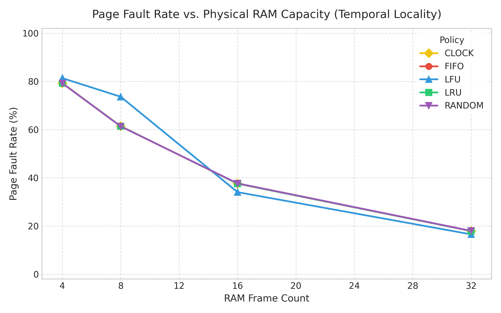
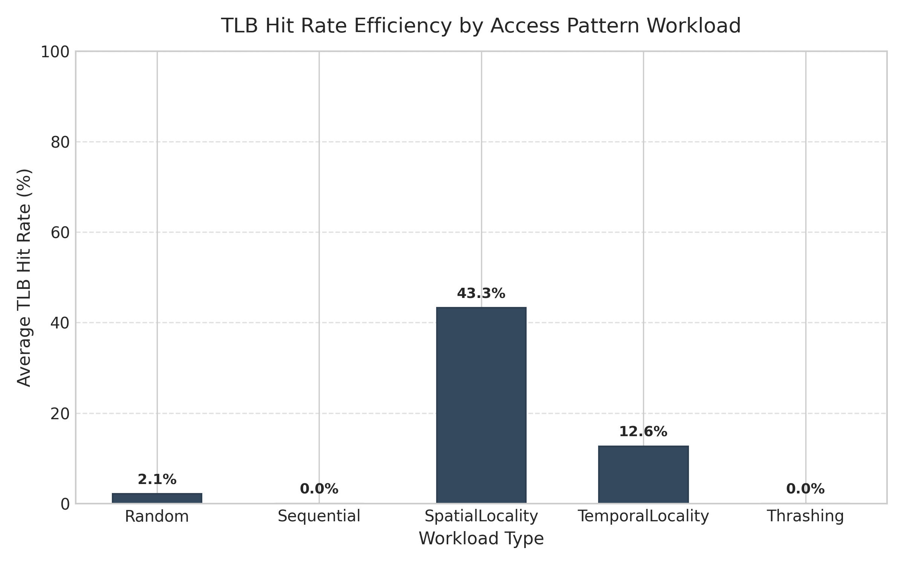
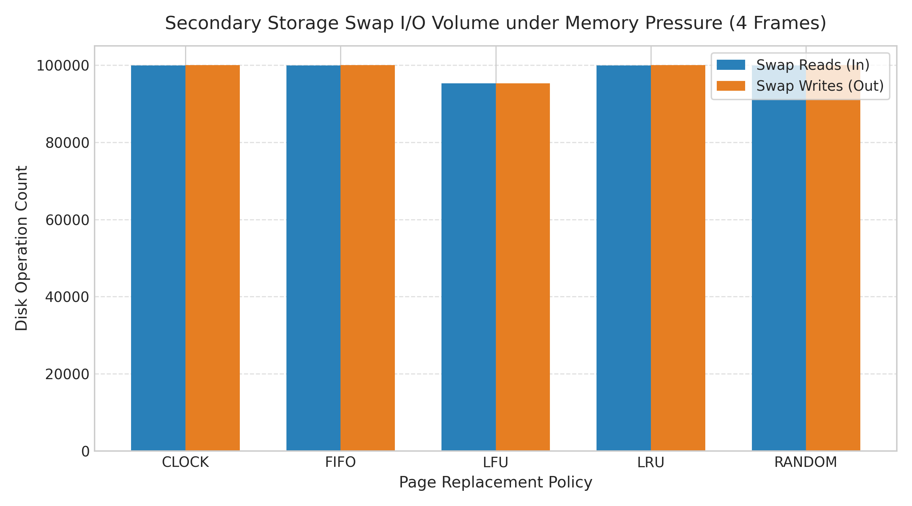

# VMM Simulator: Benchmark & Performance Profiling Report

## 1. Overview & Test Methodology

This report presents the performance evaluation of the Virtual Memory Manager (VMM) simulator across 300 automated benchmark runs. The profiling suite measures page translation latency, TLB caching efficiency, page fault frequencies, and secondary storage (Swap) I/O overhead.

### Experimental Setup
* **Workloads Tested:** Sequential (`seq`), Random (`rand`), Temporal Locality (`temp`), Spatial Locality (`spatial`), and Thrashing (`thrash`).
* **Page Replacement Policies:** FIFO, LRU, LFU, CLOCK, and RANDOM.
* **Physical Memory Capacity:** 4, 8, 16, and 32 Physical Frames (Page size: 4096 bytes).
* **Access Scale:** 10,000 to 1,000,000 memory reference instructions.
* **TLB Configuration:** 16 entries, fully associative.

---

## 2. Page Fault Rates vs. Physical Memory Capacity

Memory availability directly dictates system thrashing. Under temporal locality patterns, increasing physical RAM frames drastically reduces page faults across all algorithms.

### Key Observations
* **LRU vs. CLOCK Parity:** The CLOCK policy closely mirrors LRU performance across all frame configurations, validating CLOCK as a computationally efficient $O(1)$ approximation of true LRU.
* **Uniform Locality Degeneracy:** Under uniform random distributions, LRU, FIFO, and RANDOM converge toward equivalent fault rates due to the absence of persistent hot/cold page distinctions.
* **LFU Anomaly:** LFU exhibits higher fault rates in small frame counts (4–8 frames) because frequency counters require warm-up time and tend to retain stale historical pages (*frequency pollution*).

---

## 3. TLB Cache Efficiency Across Workload Patterns

Translation Lookaside Buffer (TLB) hit rates depend strictly on reference locality rather than memory replacement policies.

### Workload Analysis
* **Spatial Locality (43.3% Hit Rate):** Accessing sequential strides within the same page offsets yields maximum hit rates before page boundaries are crossed.
* **Temporal Locality (12.6% Hit Rate):** Frequent re-accesses to a working set of pages maintain high TLB retention.
* **Sequential & Thrashing (0.0% Hit Rate):** Single-pass sequential strides and working sets exceeding TLB capacity invalidate entries before re-use, resulting in total cache misses.

---

## 4. Secondary Storage Swap I/O Volume

Under severe memory pressure (4 physical frames vs. 64 virtual pages), every page fault forces page eviction to secondary storage.

### Disk Operation Dynamics
* **Dirty Page Writes:** Pages marked with dirty bits ($W=1$) force a 1:1 ratio between **Swap Read (In)** and **Swap Write (Out)** operations.
* **LFU Swap Reduction:** LFU retains high-frequency anchor pages permanently in RAM, reducing total Swap I/O operations by approximately 5% under thrashing workloads compared to FIFO/LRU.

---

## 5. Architectural Recommendations

1. **Policy Selection:** Use **CLOCK** for general-purpose workloads. It provides near-identical hit rates to LRU without maintaining dynamic linked lists or timestamps.
2. **TLB Sizing:** For large virtual address spaces, expanding TLB reach (e.g., supporting huge pages or multi-level TLBs) is required to mitigate $0\%$ hit rates in sequential scanning.
3. **Write-Back Optimization:** Implementing an asynchronous page-out daemon (*cleaner thread*) can decouple disk write latencies from the page fault handling critical path.